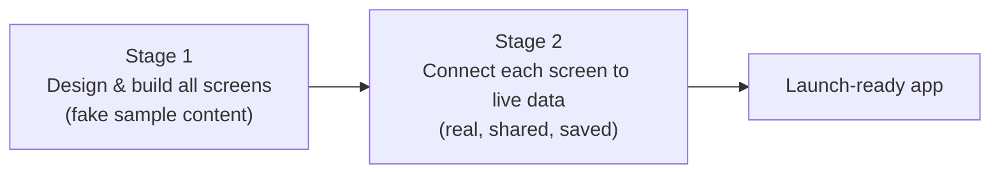
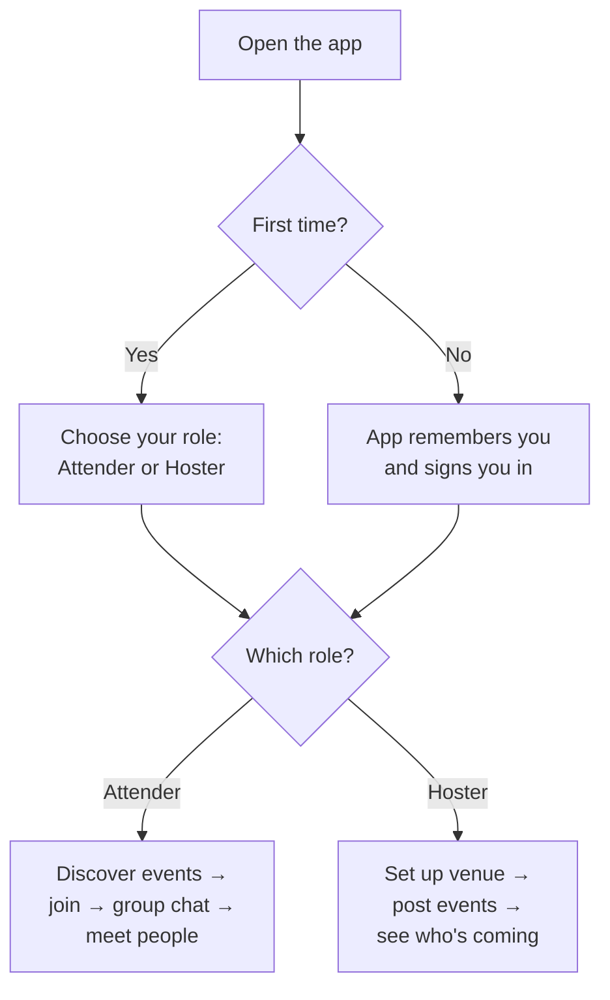
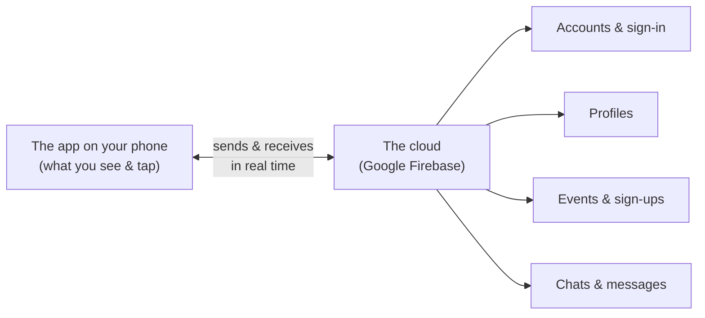
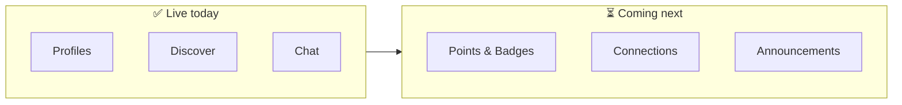
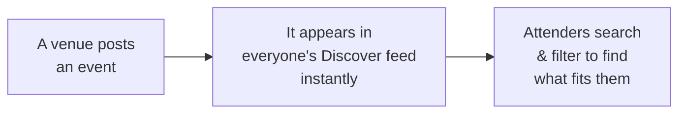
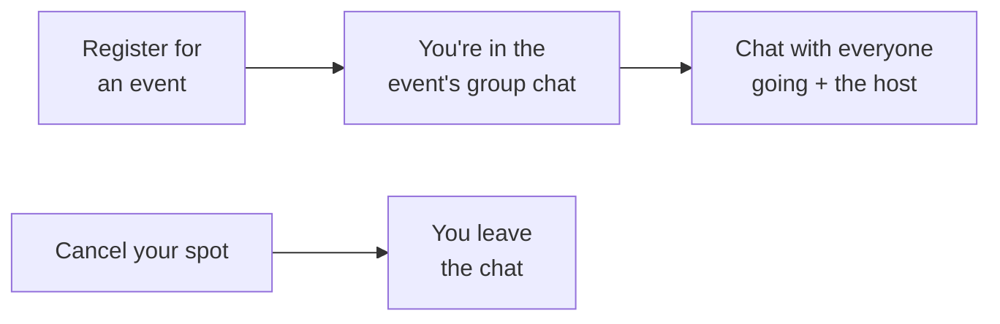
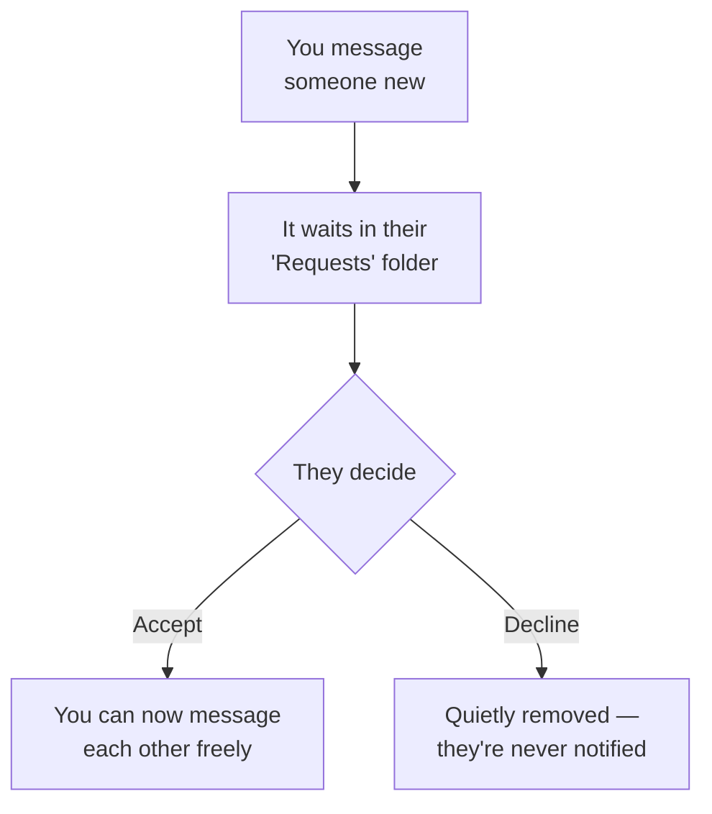
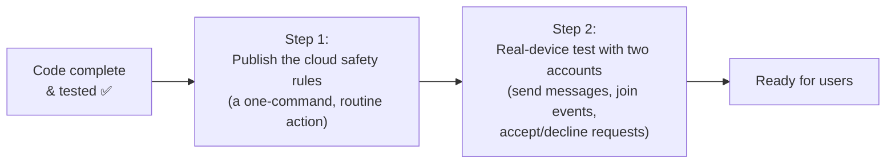

# The Third Space — Progress Report for the Founder

_Last updated: 28 June 2026 · Branch: `feature/role-dashboards`_

This report is written in plain language. No engineering background needed. It explains **what the app is, what works today, and what's left before launch.** Diagrams are included wherever a picture makes things clearer.

---

## 1. The one-minute summary

The Third Space is a mobile app that helps people discover real-life community events near them, show up, and connect with the people they meet there.

We built the app in two stages:

- **Stage 1 — the look and feel.** Every screen was designed and built so the app *looks* finished. At this stage the screens showed **example (fake) content** so we could perfect the experience.
- **Stage 2 — making it real.** We are now replacing the fake content, one area at a time, with **live data** that flows to and from the cloud. So far **three of six areas are fully live.**

**Where we are right now:** Stage 2 is **50% complete** (3 of 6 areas live). The three that are live are the core of the everyday experience: **your profile, finding events, and chatting.**

---

## 2. What the app actually is

Think of The Third Space as having two kinds of people:

- **Attenders** — people who want to *find and join* events and meet others.
- **Hosters** — venues or organisers who *create and run* events.

The app shows each person a different home screen based on who they are.

---

## 3. How the app works, at a glance

The app on the phone is the part people see and touch. Everything that needs to be **saved, shared, or kept in sync between people** lives in the cloud (we use Google's Firebase, a trusted, industry-standard service). When one person sends a message or joins an event, the cloud instantly updates what everyone else sees.

**Why "real time" matters:** when a venue posts a new event, or someone replies in a group chat, it shows up for everyone **immediately** — no refreshing, no waiting.

---

## 4. Progress: the six areas of Stage 2

The everyday experience is made of six areas. We're building them one at a time so each is solid before moving on.

| # | Area | What it does | Status |
|---|------|--------------|--------|
| A | **Profiles & Identity** | Who you are: your photo, bio, interests, neighbourhood | ✅ **Live** |
| B | **Discover & Filters** | Finding events: search, categories, filters | ✅ **Live** |
| C | **Chat & Messaging** | Group chats for events + private messages | ✅ **Live** |
| D | Points & Badges | Rewards for showing up and taking part | ⏳ Planned |
| E | Connections | Following and connecting with people you meet | ⏳ Planned |
| F | Venue Announcements | Hosters broadcasting updates to attendees | ⏳ Planned |

The three live areas are the heart of the app — a person can sign up, build a profile, find an event, join it, and start chatting with the group. **That full loop works today.**

---

## 5. The three areas that are now live

### A. Profiles & Identity ✅

Every member has a real profile: a photo, a short bio, their interests, their neighbourhood, and their age. When you look at someone in an event's guest list or in a chat, you see **their real profile**, not a placeholder. Profiles update instantly — edit yours and it's reflected everywhere it appears.

### B. Discover & Filters ✅

The Discover screen now shows **real, upcoming events** as venues post them. People can:

- **Search** by event name, venue, or neighbourhood.
- **Filter** by category (Music, Wellness, Food & Drink, etc.), by date (today, this weekend, this week), by neighbourhood, and hide 21+ events.
- See a **live count** ("Show 12 events") that updates as they adjust filters.

### C. Chat & Messaging ✅ _(just completed)_

This area has three parts:

**1. Event group chats.** When you register for an event, you're automatically placed in that event's group chat with everyone else who's going (and the host). Cancel your spot and you leave the chat. This is where attendees coordinate before and after.

**2. Private messages with a polite gate.** You can message another member directly. To protect people from unwanted messages, the **first** message to someone new lands in their **"Requests"** folder rather than their main inbox. They choose what happens next:

This "ask once, then it's open" approach keeps the app friendly and safe without being annoying.

**3. Unread counts and mute.** Every chat shows an accurate unread badge, and any chat can be muted — exactly what people expect from a messaging experience.

---

## 6. A note on safety and privacy

Because chats and profiles involve people's personal interactions, we put **rules in the cloud** that enforce who can see and do what. In plain terms:

- You can only read an event's group chat if you've actually **registered** for that event (or you're the host).
- You can only read a private conversation you're **part of**.
- Only **you** can edit your own profile and your own read/notification settings.
- A declined message request is **silently removed** — the sender is never told, which protects the receiver.

These protections are written and in place. They switch on the moment we publish them to the live service (a quick, routine step — see the next section).

---

## 7. What's left before this can go live to real users

The code for the three live areas is **complete and tested**. Two practical, non-coding steps remain before real users can use the chat features on their phones:

1. **Publish the cloud safety rules.** A routine one-step action that turns on the permissions described in Section 6.
2. **Real-device test with two accounts.** Confirm two real phones can message each other, join an event group, and that requests, unread badges, and mute all behave correctly. (Automated tests already pass; this is the final human check.)

Neither is a development task — they're standard release steps.

---

## 8. What's coming next

The remaining three areas build on the foundation that's now in place:

- **Points & Badges (D)** — reward members for showing up and participating, to drive repeat engagement.
- **Connections (E)** — let people follow and stay connected with those they meet, turning one-off meetups into a real network.
- **Venue Announcements (F)** — let hosts broadcast updates to everyone attending their events.

Each will be designed, built, and connected to live data the same careful way — one solid area at a time.

---

## 9. Plain-language glossary

| Term you might hear | What it means |
|---------------------|---------------|
| **Live data** | Real information that's saved and shared between people, instead of fake sample content. |
| **The cloud / Firebase** | Google's trusted online service where accounts, profiles, events, and messages are stored and kept in sync. |
| **Real time** | Updates appear for everyone instantly, with no refreshing. |
| **Attender / Hoster** | The two roles: people who join events vs. venues that run them. |
| **Request gate** | The "first message waits in Requests until accepted" safety feature for private messages. |
| **Cloud safety rules** | The cloud-side guardrails that enforce who can read and write what. |

---

_This report reflects the state of the `feature/role-dashboards` branch as of 28 June 2026: Stage 2 areas A, B, and C complete; areas D, E, and F planned._
